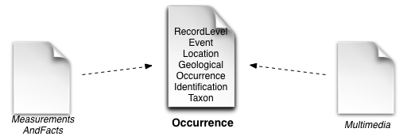
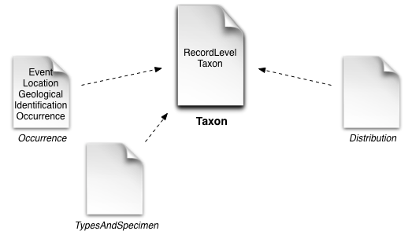
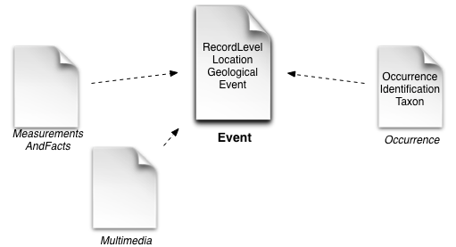
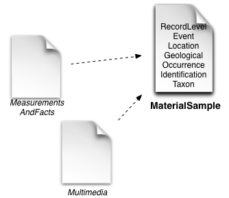
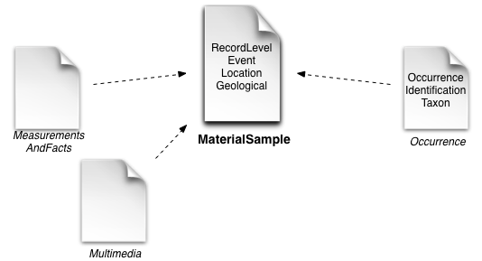

Darwin Core Archive Examples
=============

This document addresses current or intended uses of Darwin Core (DwC) Archives that contain some sort of primary biodiversity data, i.e. primary species occurrence records. The intent is not to explain the Darwin Core Archives format as such, or Darwin Core in general, and assumes the reader knows about the technical details. For further information, please use the following sources:

 * Darwin Core Terms: http://rs.tdwg.org/dwc/terms/index.htm
 * GBIF how to guide: http://www.gbif.org/resources/2552
 * Official meta.xml specs: http://rs.tdwg.org/dwc/terms/guides/text/index.htm

Uses cases are divided up by the core class used in the archive, specified as the *rowType* in the *meta.xml*.

# Occurrence
Classic, simple and flat records using the Occurrence rowType with all available dwc terms (only excluding [MeasurementOrFact](http://rs.gbif.org/extension/dwc/measurements_or_facts.xml) and [ResourceRelationship](http://rs.gbif.org/extension/dwc/resource_relation.xml) terms).

The location, event and taxon identification terms are all included in the core and a single occurrence record must therefore be taxonomically homogeneous. It is adequate though to publish a single record for multiple individuals - dwc:individualCount can be used to declare exact numbers or a [new term currently under discussion](#abundance-term) for a more general abundance/quantity measurement suitable also for organisms like protists, fungi, grasses, etc.

The *dwc:basisOfRecord* term is used in this scenario to mark specimen, fossil, observation or living organism records. 

# Taxon
Archives using the Taxon class as the core are mostly referred to as *checklists*. They use only the taxonomic terms in the core and have extensions to publish data about specimens, descriptions, vernacular names, literature, multimedia and other data about taxa.

### Occurrence extension
The Occurrence class is used here as an extension. It is in use by Plazi and Pensoft to list the specimens from the materials cited section of a taxonomic treatment. The Chinese Academy of Sciences is about to publish a large chinese checklist as part of Species2000 with occurrence data in an extension. 

As the taxon terms are already used in the core the Occurrence extension covers the remaining Location, Event, GeologicalContext, Identification & Occurrence terms. In theory the extension could also be used to list observations (again indicated by dwc:basisOfRecord).

Note that GBIF requires the presence of a unique *dwc:occurrenceID* although this is not strictly mandated by the DwC archive specification which only requires an identifier for the core records, not for extensions.

__Example__ *"Six new species of ants from Egypt"* from Plazi:
 * DwC archive: http://plazi.cs.umb.edu/GgServer/dwca/D4F853101EB8608A8BD0E5B08F2CB167.zip
 * GBIF dataset page: http://www.gbif.org/dataset/1586aec3-17ca-44c7-ba95-a38c2a467465	

__Example__ *3i - Cicadellinae Database*:
 * DwC archive: http://ctap.inhs.uiuc.edu/dmitriev/Export/DwCArchive_Cicadellinae.zip
 * GBIF dataset page: http://www.gbif.org/dataset/26bca1b5-3ef6-4e97-9672-0058c79185fb

### TypesAndSpecimen extension
Alternatively to an extension based on the Occurrence rowType GBIF had previously defined a special, small extension to publish the type material found in taxonomic literature: http://rs.gbif.org/extension/gbif/1.0/typesandspecimen.xml

It is pretty much a subset of Occurrence and was designed before anyone was using the Occurrence rowType as an extension. Note that there is no occurrenceID or any other similar identifier in this extension. The extension is in use by some checklist datasets, notably the datasets published by the [Species File Group](http://www.gbif.org/publisher/47a779a6-a230-4edd-b787-19c3d2c80ab5).

__Example__ *Orthoptera Species File*:
 * DwC archive: http://ipt.speciesfile.org:8080/archive.do?r=orthoptera
 * GBIF dataset page: http://www.gbif.org/dataset/af66d4cf-0fd2-434b-9334-9806a5efa6f7

### Distribution extension
Another checklist extension was created to publish synthesized species ranges often found in Faunas and Floras. A distribution record does not listen exact point locations of a species, but instead indicates some larger area like a country or a biogeographic region where it is expected to exist: http://rs.gbif.org/extension/gbif/1.0/distribution.xml

This extension was designed to also publish absence data indicated by an appropiate *dwc:occurrenceStatus*.

# Event
The use of Darwin Core for sample-based data was explored in a recent [workshop](http://www.standardsingenomics.org/index.php/sigen/article/view/sigs.4898640/1067) and currently, GBIF, as a partner in the EU BON project is [investigating](GBIF-IPT-for-sample-data.docx) the use of the [dwc:Event core](http://rs.gbif.org/sandbox/core/dwc_event.xml) to publish sample-based data using a special prototype of the [IPT](http://www.gbif.org/ipt) which is available at http://eubon-ipt.gbif.org/. Sample-based data is a type of data available from thousands of environmental, ecological, and natural resource investigations. These can be one-off studies or monitoring programmes. Such data are usually quantitative, calibrated, and follow certain protocols, so that changes and trends of populations can be detected.  This is in contrast to opportunistic observation and collection data, which today form a significant proportion of openly accessible biodiversity data.

The (Recording)Event core holds data about the where and when, so it covers all terms from Location, GeologicalContext and Event. 
To describe the exact kind of survey, dwc:samplingProtocol and dwc:samplingEffort from the Event group can be used.

Systematic surveys often need to relate sampling events with each other. To do that the generic ResourceRelationship extension could be used, but a distinct new term like *eventSeries* or *parentEventID* might be better suited. 

The core event records would use *dwc:eventID* as the primary key to the core records. The *dwc:basisOfRecord* should be Observation????

__Example__ *Rhine Main Observatory Aquatic Invertebrates Biodiversity*:
 * DwC archive: http://eubon-ipt.gbif.org/archive.do?r=rhine-main-observatory-aquatic-invertebrates
 * IPT dataset page: http://eubon-ipt.gbif.org/resource.do?r=rhine-main-observatory-aquatic-invertebrates

### Occurrence extension
Using the [Occurrence rowType](http://rs.gbif.org/sandbox/extension/event_occurrence.xml) as an extension to the Event core together with some proposed new terms relating to [abundance](#abundance-term) - specifically *quantity* and *quantityType* - allows for publishing species abundance matrices found in sample-based data such as Braun Blanquet vegetation plots or long term monitoring data.

As the Event core already covers Location, GeologicalContext and Event terms, the extension data only needs to hold Taxon, Identification and Occurrence terms. In some cases the actual extension data can be very simple and only use the occurrenceID and scientificName terms. Although abundance, individualCount, occurrenceStatus, recordedBy, recordNumber, sex, establishmentMeans and lifeStage should be useful additional terms in many cases.

Populating *occurrenceStatus* with *absent* allows in principle to also publish absence data as available in many surveys. It needs to be supplied explicitly for every species though so the approach is somewhat limited compared to declaring some taxonomic sampling context for the entire event or dataset.

### MeasurementOrFact extension
Having a [measurement extension](http://rs.gbif.org/extension/dwc/measurements_or_facts.xml) linked to a core Event allows to publish measurements about a site like temperature or soil acidity. On the downside one cannot describe measurements about a single specimen or observation as these are living in an extension as well.

# MaterialSample
Darwin Core added a new class term [MaterialSample](http://rs.tdwg.org/dwc/terms/index.htm#MaterialSample) in 2013 which can be used to publish occurrence data in new ways. A key driver for this new term are gene sequence based biodiversity data that are based on some sampling like tissue extractions, water or soil samples. Right now, there are two different proposals existing to use a MaterialSample core in Darwin Core archives mainly differing in the cardinality of a sample and species occurrence.

In order to distinguish the kind of sample basisOfRecord can be used if the vocabulary is extended. 

### EnvO
The environment from which a material sample is derived needs to be described. The Environment Ontology [EnvO] (http://environmentontology.org/) provides a controlled vocabulary for the description of environments, providing greater granularity than is currently possible with the Darwin Core *habitat* term. In addition to [habitat](http://purl.obolibrary.org/obo/ENVO_00002036), EnvO provides three broad classifications for environment - biome, feature, and material. Using ENVO in Darwin Core would allow for standardised searches across environmental descriptions for a broad range of species/samples, including metagenomic samples which use the [MiXS](http://www.nature.com/nbt/journal/v29/n5/full/nbt.1823.html) standard which already specifies use of EnvO terms. 
 

Currently under review is a proposal that the value of the Darwin Core *habitat* property be selected from the EnvO habitat class and that three new properties (environmental material, environmental feature, and biome) be added to Darwin Core and their values drawn from the equivalent EnvO classes.

### "Specimen" core

As an outcome of the GSC16 BCO Hackathon in Oxford John Wiezcoreck created a [MaterialSample core](http://rs.gbif.org/sandbox/core/dwc_material_sample.xml) that contains all terms a simple [Occurrence](#Occurrence) core also provides, but using the rowType *dwc:MaterialSample* with the *dwc:materialSampleID* identifier instead of *dwc:occurrenceID*.

It is proposed to use this rowType for all specimens, fossils and living organisms to make them distinct from pure observations which should still be using the *dwc:Occurrence* core. It can then also be used to publish data from the Global Genome Biodiversity Network (see [TDWG 2013 report](TDWG2013GGBNWGReport_) where the main use case relates to DNA/tissue extraction and ability to follow a  chain of sampling/extracting. For this the generic ResourceRelationship extension could be used, again, if there is a shared, globally understood vocabulary. Alternatively, a new term such as *parentMaterialSampleID* could build up such a link. The problem is very much the same as for [relating events](#resourcerelationship-eventseries-or-parenteventid).

An important requirement for (DNA) sampling is that one can follow back the chain of sampling/extracting. For this the generic ResourceRelationship extension could be used again if there is a shared, globally understood vocabulary. Alternatively a new term such as *parentMaterialSampleID* could build up such a link. The problem is very much the same as for [relating events](#resourcerelationship-eventseries-or-parenteventid).

As the core contains the Taxon and Identification terms it can only be used to describe samples that contain (or a derived from?) a single taxon. This prevents it's use for environmental samples.

### Occurrence extension

Based on the needs for environmental sampling and their subsequent metagenomic DNA sequencing the MaterialSample core could be restricted to just the sampling event covering terms from Location, Event, GeologicalContext and MaterialSample. Taxon abundance data would be stored in an *dwc:Occurrence* extension that covers the remaining Taxon, Identification and Occurrence terms. This setup is very much the same as for sample-based data using the *dwc:Event* core, but using the *dwc:MaterialSample* rowType and a different *dwc:materialSampleID* identifier.

For metagenomic results every cell of an [OTU abundance table](http://www.wernerlab.org/teaching/qiime/overview/c) would become an occurrence extension record with the abundance given using the [new term](#abundance-term). A standard format for OTU tables is the [biom format](http://biom-format.org/documentation/biom_format.html).

# Discussion
### Abundance term
What exact new terms are needed to model various ways of measuring species abundance.
Open Darwin Core issues:
 * https://code.google.com/p/darwincore/issues/detail?id=142
 * https://code.google.com/p/darwincore/issues/detail?id=187

### ResourceRelationship, eventSeries or parentEventID

### Are both Event & MaterialSampe core needed ?

### Specimens as Occurrence or MaterialSample ?

### Deprecate TypesAndSpecimen extension ?
